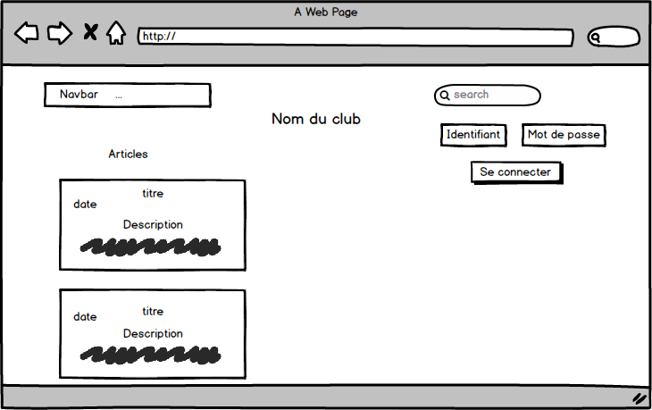

# Projet Flux RSS

## Liste des tâches 1ère itérations
- Agent de mise à jour fonctionnelle
- Une page fonctionnelle qui visualise les articles, présentés sous forme HTML issus de l’aggrégation de flux RSS.
- MCD
- Maquette du projet

## Maquette

## MCD

